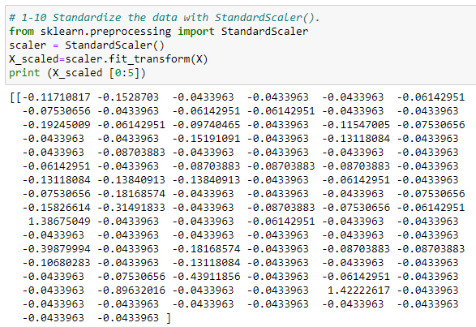
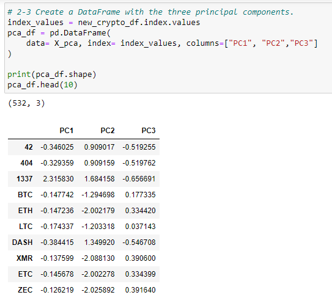
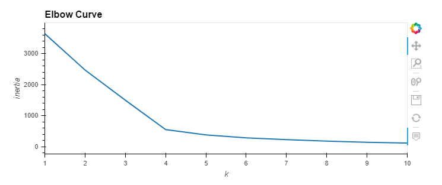
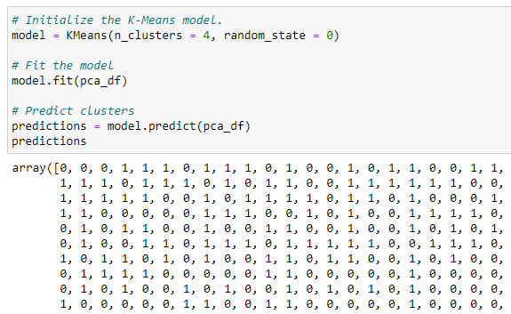
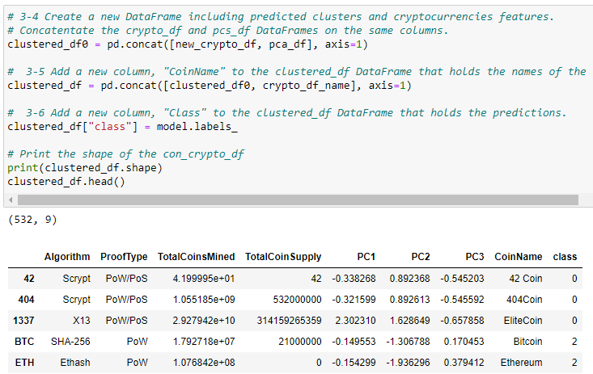
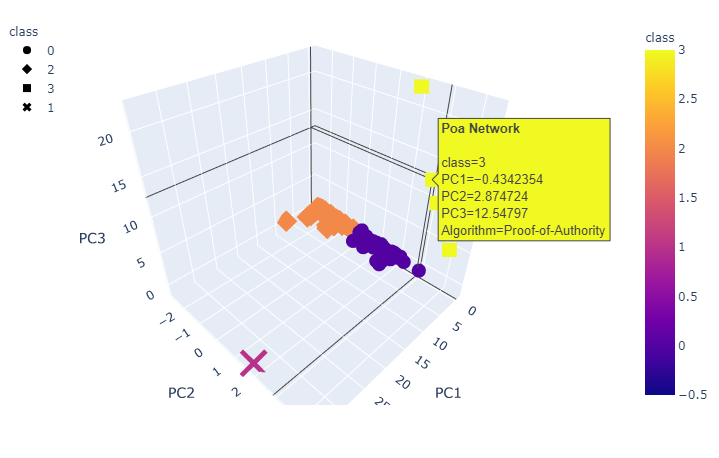
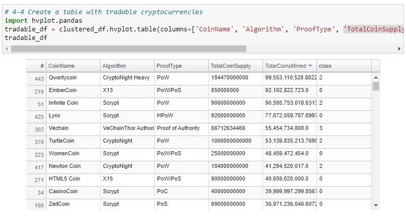
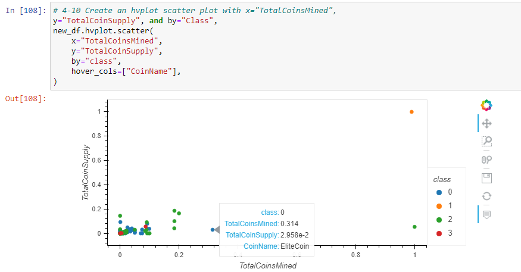

# Cryptocurrency_ML_Analysis
Unsupervised Machine Learning in Cryptocurrencies

## Background
Accountability Accounting, a prominent investment bank, asked us to create a report that includes what cryptocurrencies are on the trading market and how they could be grouped to create a classification system for this new investment. The data retrieved from CryptoCompare is not ideal, so it will need to be processed to fit the machine learning models. We will use the clustering algorithm for the cryptocurrencies to share her flndings with the group.

## Objects
1. Preprocess cryptocurrency data for unsupervised learning.
2. Reducing Data Dimensions Using Principal Component Analysis (PCA) to limit features and speed up the model.
3. Cluster data using the K-means algorithm and determine the best amount of centroids for K-means using the elbow curve.
4. Visualizing Cryptocurrencies Results with scatter plots with Plotly Express and
hvplot.

## Software/Tools/Libraries
* Jupyter Notebook 6.1.4 with numpy, pandas, hvplot,  pathlib, plotly.express.   scikit-learn with StandardScaler, MinMaxScaler, decomposition with PCA, cluster with KMeans.

* Data Source: 
The crypto_data.csv was retrieved from CryptoCompare (https://minapi.
cryptocompare.com/data/all/coinlist).

## Results

### Task 1: Preprocessing the Data for PCA

* Using the knowledge of Pandas, import and preprocess the crypto_data.csv in order to perform the Principal Component Analysis (PCA)

* A clean DataFrame is created that stores all cryptocurrency names from the CoinName column and retains the index from the crypto_df DataFrame and standardized using the StandardScaler

### Task 2: Reducing Data Dimensions Using PCA

* Using the knowledge of the Principal Component Analysis (PCA) algorithm, reduce the dimensions of the X DataFrame to three principal components, and place these dimensions in a new DataFrame

* The PCA algorithm reduces the dimensions of the X DataFrame down to three principal components, PC 1 , PC 2 , and PC 3, and has the index from the crypto_df
DataFrame.

### Task 3: Clustering Cryptocurrencies Using K-means

* Using the knowledge of the K-means algorithm, create an elbow curve using  hvPlot to find  the best value for K. Then, run the K-means algorithm to predict
the K clusters for the cryptocurrencies’ data.

* Elbow Curve to find the best value for K

* Prediction on the K clusters of the cryptocurrencies

* Create a new DataFrame including predicted clusters and cryptocurrencies features

### Task 4: Visualizing Cryptocurrencies Results

Using the knowledge of creating scatter plots with Plotly Express and
hvplot, visualize the distinct groups that correspond to the three
principal components, then create a table with all the currently tradable cryptocurrencies.

* 3D scatter plot using the Plotly Express to plot the three clusters (PCA)

* Table with all the currently tradable cryptocurrencies 

* 2D scatter plot with "TotalCoinsMined" (x-axis) and "TotalCoinSupply" (y-axis) 

This 2d scatter plot display the relationship between total coin supply and total coins mined to show how each currency compares to the rest. 

## Summary

Elbow curve, 2D, and 3D scatter plot shows four different groups in the cryptocurrency data. Two groups are close horizently with most currencies falling into one of these two groups. the other two groups hav a few different currencies that are farther away from the two group. This scatter plot shows that most of criptocurrrency have similiar trend but a few group have diffferent behaveir similiary to the outliers.

## Recommendation

It would be good to see the historical pricing of these cryptocurrencies to understand the performance of each of these currencies. This may help the investors how stable or risky for their cryptocurrencies based on the price changes.
